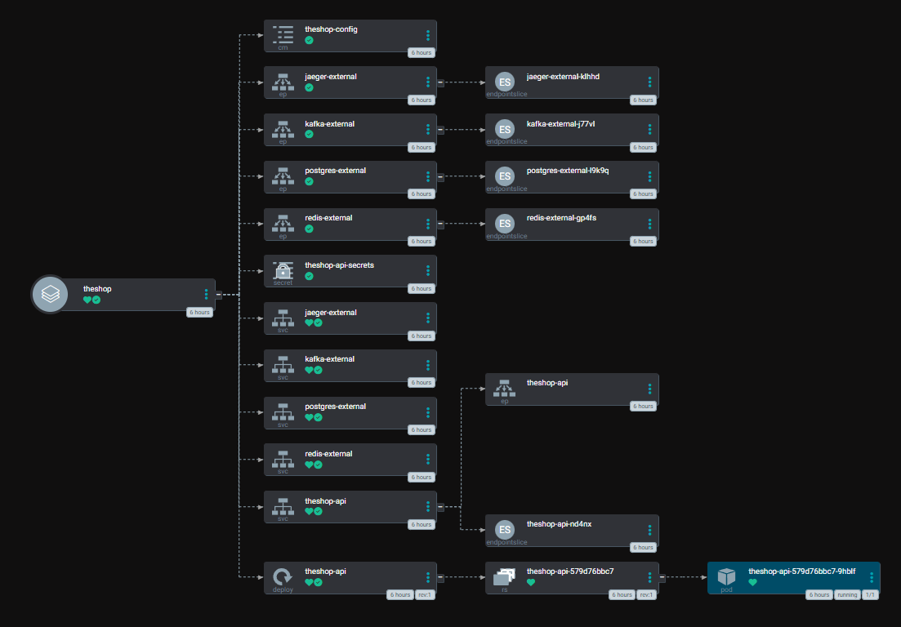

# TheShop-Demo Kubernetes Deployment Guide

Hybrid deployment setup:
- **Kubernetes (via ArgoCD)**: TheShop API + WebApp
- **Docker**: PostgreSQL, Redis, Kafka, Neo4j, ChromaDB, Observability

## CI/CD Pipeline Flow

```
┌──────────────┐    ┌──────────────┐    ┌──────────────┐    ┌──────────────┐
│  Developer   │    │   GitHub     │    │   ArgoCD     │    │  Kubernetes  │
│  pushes to   │───►│   Actions    │───►│   detects    │───►│   deploys    │
│  main branch │    │   builds     │    │   change in  │    │   API +      │
│              │    │   API +      │    │   values.yaml│    │   WebApp     │
└──────────────┘    │   WebApp     │    └──────────────┘    └──────────────┘
                    └──────────────┘
```



## Prerequisites

- **Rancher Desktop** with Kubernetes enabled
- **Docker Desktop** or Docker for running infrastructure
- **Helm 3.x**
- **kubectl** configured to Rancher Desktop

## Setup

### Step 1: Add Helm Repository

```powershell
helm repo add argo https://argoproj.github.io/argo-helm
helm repo update
```

### Step 2: Create Kubernetes Namespace

```powershell
kubectl apply -f deploy/base/namespaces.yaml
```

### Step 3: Install ArgoCD

```powershell
helm dependency update deploy/infrastructure/argocd
helm install argocd deploy/infrastructure/argocd -n argocd --create-namespace
```

### Step 4: Get ArgoCD Admin Password

```powershell
# Wait for ArgoCD to be ready
kubectl wait --for=condition=available deployment/argocd-server -n argocd --timeout=300s

# Get password (PowerShell)
$password = kubectl -n argocd get secret argocd-initial-admin-secret -o jsonpath="{.data.password}"
[System.Text.Encoding]::UTF8.GetString([System.Convert]::FromBase64String($password))
```

### Step 5: Access ArgoCD UI

```powershell
kubectl port-forward svc/argocd-server -n argocd 8080:443
# Open http://localhost:8080
# Login: admin / <password from step 5>
```

### Step 6: Deploy Applications via GitOps

```powershell
kubectl apply -f deploy/argocd/root-application.yaml
```

ArgoCD will now automatically deploy the API and WebApp to Kubernetes.

### Step 7: Deploy Kafka Connect ETL (Optional)

```powershell
.\deploy\kafka-connect\deploy-connectors.ps1
```

This sets up automatic data sync from PostgreSQL to Neo4j. See [Kafka Connect ETL Guide](KAFKA_CONNECT_ETL.md).

## Manual Deployment (Without ArgoCD)

```powershell
# Deploy API
helm install theshop-api deploy/app -n theshop --create-namespace

# Deploy WebApp
helm install theshop-webapp deploy/webapp -n theshop
```
### Configure a host IP and create K8s Services -> Endpoints

In `deploy/app/values.yaml` set:
- `externalServices.enabled: true`
- `externalServices.hostIp: <IP reachable from pods>`

## Accessing Services

### Kubernetes Services (Rancher Desktop)

| Service | URL | Description |
|---------|-----|-------------|
| TheShop API | http://localhost:30232 | .NET API |
| TheShop WebApp | http://localhost:30233 | Blazor WebApp |
| ArgoCD | https://localhost:8080 | GitOps Dashboard (port-forward) |

## File Structure

```
deploy/
├── argocd/
│   ├── apps/
│   │   ├── theshop.yaml        # API ArgoCD Application
│   │   └── webapp.yaml         # WebApp ArgoCD Application
│   └── root-application.yaml   # Root App of Apps
├── app/                        # API Helm Chart
├── webapp/                     # WebApp Helm Chart
├── infrastructure/
│   └── argocd/                 # ArgoCD Helm Chart
├── base/
│   └── namespaces.yaml
├── Docker/                     # Docker compose (PostgreSQL, Redis, Kafka, Neo4j, ChromaDB, Observability)
├── kafka-connect/              # Kafka Connect ETL connectors (PostgreSQL → Neo4j)
├── scripts/                    # Seed scripts (SQL, Cypher, Python)
└── Grafana/                    # Grafana dashboards
```

## Production Deployment Checklist

> **Note:** For production deployment, the following changes are required:

| Item | Local (Dev) | Production |
|------|-------------|------------|
| `ASPNETCORE_ENVIRONMENT` | Development | Production |
| TLS/HTTPS | Optional (self-signed) | Required (cert-manager + Let's Encrypt) |
| JWT Secret | Hardcoded in values.yaml | Kubernetes Secret (sealed-secrets or external-secrets) |
| Database credentials | Hardcoded | Kubernetes Secrets |
| OpenAI API Key | Blank in values.yaml | Kubernetes Secret |
| Neo4j/ChromaDB | Docker on host | Managed service or in-cluster deployment |
| Ingress | Optional (NodePort access) | Required with TLS termination |

### Enable TLS (Local Testing)

```powershell
# Generate self-signed certs and create K8s secrets
.\deploy\scripts\create-tls-secrets.ps1

# Add to hosts file (as Admin): C:\Windows\System32\drivers\etc\hosts
# 127.0.0.1 theshop.local
# 127.0.0.1 api.theshop.local

# Enable ingress in values.yaml
# ingress.enabled: true
```

## Troubleshooting

### Check if Docker services are running
```powershell
docker ps
```

### Check Kubernetes pods
```powershell
kubectl get pods -n theshop
```

### Check API logs
```powershell
kubectl logs -n theshop deployment/theshop-api
```

### Check if API can reach Docker services
```powershell
# Exec into API pod and test connectivity
kubectl exec -it -n theshop deployment/theshop-api -- curl -v telnet://host.docker.internal:5432
```

### ArgoCD application status
```powershell
kubectl get applications -n argocd
```

### Force ArgoCD sync
```powershell
kubectl patch application theshop -n argocd --type merge -p '{"operation": {"sync": {}}}'
```
